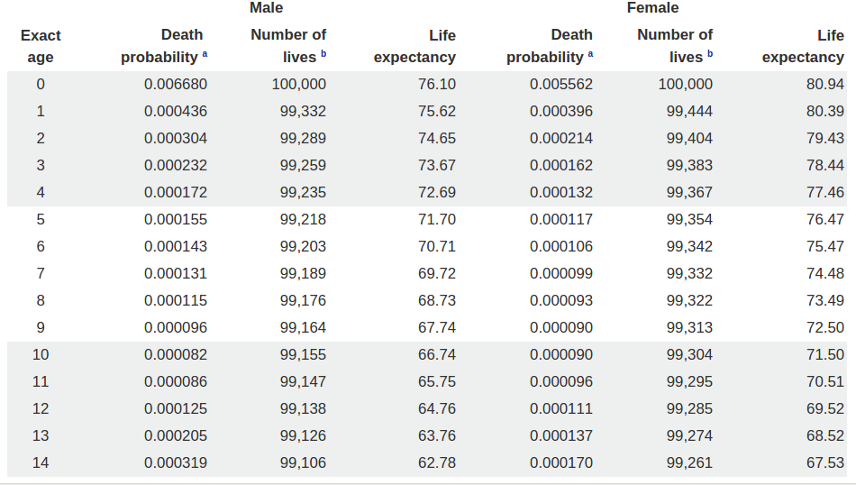
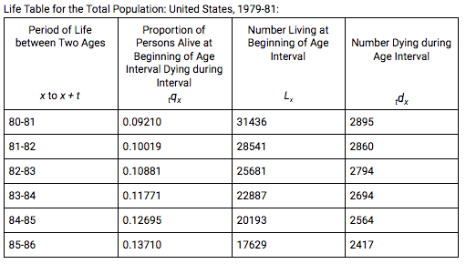

 


 
 \newpage
 
# Outstanding Material
- Possibly explain solution to problems in detail. Add more problems.

 
\newpage

#Outstanding Material
- Possibly explain solution to problems in detail
 
\newpage
 
```{r include=FALSE, cache=FALSE}
library(lifecontingencies)
```

#1.1 Life Table Components
 
__Life tables__, also known as __mortality tables__, are a way to display the conditional probability that a person will die in a certain year given that they are a certain age. They often take into account many factors including gender, occupation, socioeconomic status, lifestyle habits, and more in order to predict how much longer a life is likely to last. Life tables are used in a variety of fields. For example, actuaries use life tables in pricing insurance products or to predict financial expenses for Social Security. The following is an example of a life table.  
 &nbsp;
 
*Figure 1.1. Example of Life Table*  

 
To introduce the fundamentals of mortality tables, we will begin with a highly simplified version.
 
&nbsp; 
 
*Table 1.1. Simplified Life Table*  
```{r, echo=FALSE, comment = NA, fig.align = "center"}
x <- seq(from=90, to=100, by=1)
lx <- c(1000, 900, 800, 700, 600, 500, 400, 300, 200, 100, 0)
dx <- c(100, 100, 100, 100, 100, 100, 100, 100, 100, 100, 0)
life.table <- data.frame(x, lx, dx)
print(life.table, row.names = FALSE)
```
 
 
 
The x column represents the age of the person at the beginning of the year. The lx column represents the hypothetical number of people alive at the beginning of year $x$, which is denoted $l_x$. The dx column represents the number of people that died during year $x$, which is expressed as $d_x$.
 
Before, we mentioned that a life table should display the conditional probability of survival given that a life is age $x$. While *Table 1.1* does not display that yet, those probabilities can be calculated easily.
 
Let’s begin by focusing on a person that is 90 years old. We denote a person of age $x$ by putting the age inside parentheses. So, in this example, we denote a life of age 90 with (90). Suppose we want to find the probability that (90) survives to (91). It’s as simple as making sure we understand what the information in the life table means, and then taking advantage of the definitions of $l_x$ and $d_x$. 
 
Row 1, when $x$ = 90, represents the beginning of the first year where we know from the life table that we start with 1000 people. Row 2, when $x$ = 91, tells us that $l_{91}$ = 900 which means we expect 900 people to be alive at the beginning of year two. This necessarily means that we expect 100 people to die during the first year which is reflected by $d_{90}$. Therefore, we can represent the probability as follows:
\[Pr((90)\text{ survives to (91)}) = \frac{900}{1000} = .9\]
 
 
Now, lets calculate the probability that (91) survives to (92). Like the previous example, we will take the hypothetical number of survivors at the beginning of year two and divide it by the hypothetical number of survivors at the end of year two. 
\[Pr((91)\text{ survives to (92)}) = \frac{800}{900} \approx .889\]
 
The probabilities that we have calculated above are denoted with 
\[p_x = P((x)\text{ survives to} (x+1))\]
 where $x$ is the age of the person of interest. So, we write the probability that (90) survives to (91) as $p_{90}$, and the probability that (91) survives to (92) as $p_{91}$.  
 
We then have natural notation for the probability that a person dies within a certain year, denoted with $q_x$, where 
\[ q_x=1-p_x \].
 
In *Table 1.2* we have added columns for $p_x$ and $q_x$ to our previous life table.  
&nbsp; 
 
 *Table 1.2.*  
```{r, echo = FALSE, comment = NA}
x <- seq(from=90, to=100, by=1)
lx <- c(1000, 900, 800, 700, 600, 500, 400, 300, 200, 100, 0)
px <- lx[x+2]/lx[x+1]
qx <- 1-px
life.table <- data.frame(x, lx, dx, px, qx)
print(life.table, row.names = FALSE, digits = 3)
```
 
With *Table 1.2*, we can now calculate more conditional probabilities. In the above examples, notice that we calculated the probabilities of surviving year $x$, but what if we want to know the probability of surviving for periods longer than that? For example, suppose we want to know the probability that a 90 year old survives to (91), *and* the year after that. We can represent that as follows:
$$
\begin{aligned}
&\quad Pr((90)\text{ survives the first year and the second year}) \\
&= Pr((90)\text{ survives the first year})Pr((90)\text{ survives the second year} \mid (90)\text{ survived the first year}) \\
&= Pr((90)\text{ survives the first year})Pr((91)\text{ survives the second year}) \\
&= p_{90} p_{91} = \left(\frac{900}{1000}\right)\left(\frac{800}{900}\right) = .8
\end{aligned}
$$

 
Thankfully, we have notation for this type of problem. We write
\[_{t}p_{x} = Pr((x) \text{will survive to} (x+t))\]
So, in the previous example, we would write $_{2}p_{90}$ to represent the probability that a 90 year old reaches age 92. In general, we can calculate the probability that a person age $x$ reaches age $x+t$ with 
\[_{t}p_{x} = p_{x}p_{x+1}p_{x+2}...p_{t-1} \].  
 
Another intuitive calculation for $_{t}p_{x}$ is  
\[_{t}p_{x} = \frac{l_{x+t}}{l_{x}} \]
This makes sense because it is the proportion of people that we expect to still be alive at year $x+t$ given that we started with $l_x$.  
 
One more important calculation that can come from a life table is the probability that $(x)$ will die in some age range $u+t$. In other words, the probability that a person age $x$ will live to age $t$ and then die within the next $u$ years. We will represent this probability with  
 
$$
\begin{aligned}
_{t \mid u}q_{x} &= \ _{t + u}q_{x} -\ _{t}q_{x}  \\
&= \  _{t}p_{x} -\ _{t+u}q_{x}  
\end{aligned}
$$
 
It can also be shown that 
$$
\begin{aligned}
_{t \mid u}q_{x} &= \ _{t}p_{x} \ _{u}q_{x+t}.  \\
\end{aligned}
$$
 
We will use this to calculate $_{2\mid 3}q_{4}$, the probability that a person of age 94 lives to age 96 and then dies before age 99.
 
$$
\begin{aligned}
_{92 \mid 93}q_{94} &= \ _{92}p_{94} \ _{93}q_{94+2}  \\
&= \ p_{94}p_{95} (1-p_{96})(1-p_{97})(1-p_{98}) \\
&= (.833)(.800)(1-.750)(1-.333)(1-.500) \\
&= .0556
\end{aligned}
$$
 
 
If $u = 1$ we just write $_{t \mid}q_{x}$.
 
The future years completed by (x) prior to death is called the *curtate-future-lifetime* of (x). The expected value of this quantity, also known as the "curtate-expectation-of-life”, in life tables is commonly denoted as $\text{e}_x$, the remaining life expectancy at age x. This expectation is calculated by summing each year in life remaining times the probability of living to that year and dying in it given the age they are now. This is then rounded up to be the expected years of life left.

In our example, to calculate the expected years of life remaining for a 95 year old we would use *table 1.2*.

$$
\begin{aligned}
\text{e}(95) &= 1(100/500) + 2(100/500) + 3(100/500) + 4(100/500) + 5(100/500) \\
&= 3
\end{aligned}
$$

So a 95 year olds expected future life is 3 years.

\newpage
 
#1.2 Life Table Construction
 
Now that we have a basic understanding  of the information contained in life tables, it would be a good time to get an idea of how these life tables are constructed. 
 
There is an immense body of knowledge out there for constructing life tables, and it would take an entire book to dive into all of the details. Here, we will opt to provide a background of the different factors that are relevant to their building.
 
The most straightforward way to construct a complete life table is by observing a population at the time of birth and following them throughout the years, recording the number of deaths each year until there are no longer any survivors. The group that is being followed is called a __cohort__; so these are called __cohort life tables__. 
In the United States and many other countries, the numbers of births and deaths are recorded each year. For the U.S., there is data for births and deaths dating all the way back to 1933. If we know exactly how many people are born at 1933, we can treat them as a cohort and record deaths at each age to calculate death rates like in Section 2.1. 
 
The major drawback of a cohort life table is that we only have data in the table up until the current point in time, and can only make rough predictions for future probabilities. For example, if we began examining a cohort that was born in 1985, we would only have data in 2016 that reflects a life table through age 31. Trying to predict the death rates for people aged 40, 50, and 60, could put us at risk of large error by extrapolation.
 
This leads us to another common type of life table, called a __static__, or __period__, __life table__. This method involves looking at an entire population over a short period of time; most commonly 1-3 years. This is often done around a census period, where one can utilize information about total number of people alive in a country or region and what age they are. By then looking at the number of deaths and age of death over the short time period, we can estimate the death rates at each age.
 
The downside to period life tables is that this snapshot of death rates may not be reflective of the death rates that younger people will experience when they’re older. For example, the probability of death for an 85 year old in the current period life table is not likely to be the probability of death when an 18 year old actually turns 85 due to advances in medicine or other changes in the environment.
 
Another common approach to constructing a life table is by statistical modeling. Like we’ve seen in our statistics classes, it may be the case that fitting a model will provide  deeper insight into our data, and a more accurate way to estimate or forecast. There are several popular methods for modeling death rates, and they all try to compete to be the best one by including different parameters or making different assumptions. A detailed comparison of some of the most popular methods can be found via a link in the appendix.
 
As we’ve shown, the collection of data and creation of a life table is a serious project. The Society of Actuaries (SOA) website has a substantial list of mortality tables that can be broken down by factors such as type and country. These come from a variety of sources including the IRS and independent studies.
 
 \newpage

#1.3 Life Tables in R

For Exam MLC, the SOA uses the life tables available in the R package ‘lifecontingencies.’ This package includes mortality tables and built-in functions for common actuarial computations. According to the package creator, “The main purpose of the package is to provide a comprehensive set of tools to perform risk assessment of life contingent insurances.”(Giorgio Alfredo Spedicato) Our goal in this section and in future modules is to show how to utilize this package to make actuarial computations easier, and to reinforce some of the concepts introduced in the material.

We begin by opening the R console, and typing
```{r, eval = FALSE}
install.packages("lifecontingencies")
```
Then, after it installs,
```{r, warning = FALSE, message=FALSE}
library(lifecontingencies)
```

The life contingencies package assumes that a life table has two columns x and $l_x$. So it is possible to use the package functions on user created mortality tables. However there are built-in life tables in the package.  

The following coade loads in one of the built-in life tables. The most common for MLC is soa08.
```{r}
data(soa08)
head(soa08)
```
Now, let’s answer a few questions that may come up in the context of a life table problem. For example, how many people died from the beginning of year one to year three? What is the probability of death from birth to year three? What is the probability (*x*) survives year three? With the *dxt*, *qxt*, and *pxt* functions, this is easy.   

This is how you compute $_3d_0$, the number of deaths in the first 3 years, in R.

```{r}
dxt(soa08, x = 0, t = 3)
```

This is how you compute $_3q_0$, the probability of dying within the first three years, in R.  

```{r}
qxt(soa08, x = 0, t = 3)
```

This is how you compute $_3p_0$, the probability of surving the first three years, in R.  

```{r}
pxt(soa08, x =  3, t = 1)
```

This is how you compute the curtate expected future life for $\text{e}(60)$, the expected years of life remaining for a sixty year-old, in R.

```{r}
exn(soa08,x=60,type = "curtate")
```
These can of course be computed by hand using the counts in the life table, but this is much easier and quicker.


\newpage

#Problems

##1.

Referring to table below, evaluate the probability that someone that survives to (82) will  
a. live to year 84.  
b. die before year 85.  
c. die during 85th year of life.  



##2.    
(Saving the soa.08 data as a data frame)   
Using the soa.08 data set, recreate the following columns in R.  
a. ($p_x$) \hspace{3cm} (hint: take next $l_x$ / current $l_x$)   
b. ($e_x$)	 \hspace{3cm} (hint: sum expectation during remaining years / current $l_x$)    


Use the following code to subset the data:  


```{r, eval = FALSE}
new_soa.08 = soa.08[,1:2]  
```

\newpage

#Solutions  
 
Problem 1:  

1a.   

$$  \frac{l_{84}}{l_{82}} = \frac{20193/100000}{25681/100000} = \frac{20193}{25681} = 0.7863  $$  


1b.  

$$  1 - \frac{l_{85}}{l_{82}} = 1 - \frac{17629}{25861} = 0.3183 $$  

1c.  

$$ \frac{(l_{84} - l_{85})}{25681} = \frac{(20193 - 17629)}{25681} = 0.09984 $$  

Problem 2:  

2a.  

There are many ways to code this, one option for ($p_x$) would be:  

```{r, eval = FALSE}
for (i in 1:length(row.names(new_soa.08))){
       new_soa.08$px[i] =  new_soa.08$lx[(i+1)]/ new_soa.08$lx[i]
}

new_soa.08$px[length(row.names(new_soa.08))] = 0
```

\vspace{1cm}

2b.

 One option for creating ($e_x$):

```{r, eval = FALSE}
for (i in 2:length(row.names(new_soa.08))){
     new_soa.08$ex[i] = 
         sum(new_soa.08$lx[-c(1:(i-1))] * new_soa.08$px[-c(1:(i-1))])
         / new_soa.08$lx[i]

}

new_soa.08$ex[1] = sum(new_soa.08$lx * new_soa.08$px)
                 / new_soa.08$lx[1]
```


\newpage

## References

The following resources are available for reference and were involved in the making of this module.

Bowers Jr., Newton, et. al. *Actuarial Mathematics*. The Society of Actuaries. 1997.

http://mort.soa.org/ - SOA life tables

https://cran.r-project.org/web/packages/lifecontingencies/lifecontingencies.pdf - lifecontingencies package
