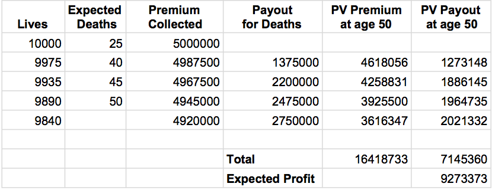
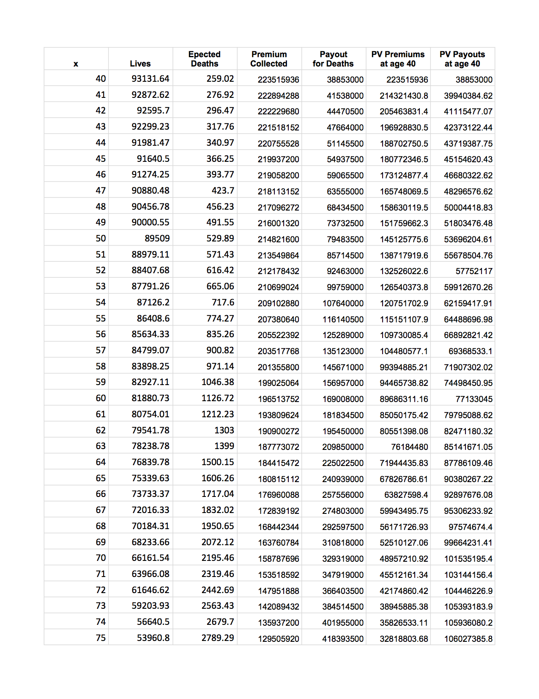
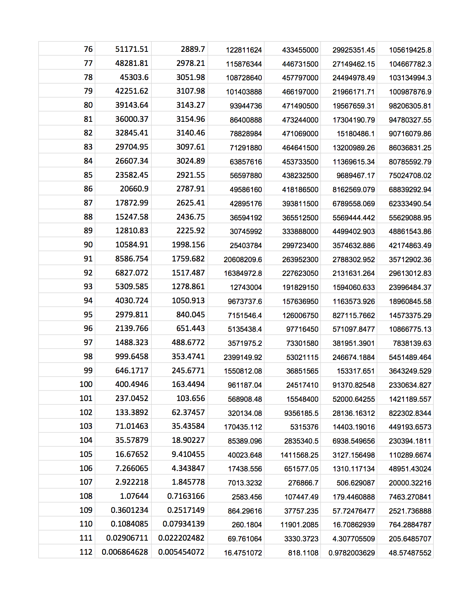
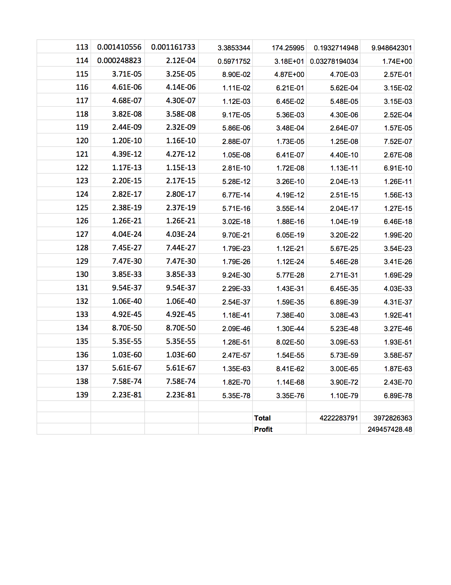

```{r, echo=FALSE, messages = FALSE, warning=FALSE, results='hide'}
library(lifecontingencies)
```

#Outstanding Material
- Maybe add example of whole-life in section 2.3, but Problem 1 is whole-life.
- Add example of n-year endowment in 2.3.
- Add example with numbers after n-year pure endowment in 2.3.
- Add a problem in the continuous case.
- Possibly explain the calculations in the table.

#Introduction

Life insurance is a contract between an insurance company and a policy holder where the insurer agrees to pay a sum of money contingent upon a life event (e.g. death). Death is indeed a random event, and actuaries in life insurance are tasked with developing systems that account for the probability of death and the payments to be made. This can be done in a variety of ways. In this section we aim to introduce the main types of life insurance and how these models are derived using basic principles of probability and finance. By the end of this module, the reader should have an understanding of the basics of life insurance, and some insight on how actuaries deal with these problems in real life.

#2.1 Basic Insurance Computations

A major component of life insurance is the amount that the insurer pays, which is called the benefit. The benefit can of course be any positive value, but for introduction in this module we will only consider benefits of 0 or 1, as defined by the benefit function, $b_t$. Since insurance depends on mortality, we must also consider the future lifetime random variable, T. Lastly, recall from intro finance the discounting factor $v_t$ for time value of money computations.

The present value of a benefit paid at time T is $b_T v_T$. Since T is a random variable, so is the present value of the payments, Z = $b_T v_T$. The expected value of the random variable $Z$, is what we call the **actuarial present value** (APV) of the insurance. The actuarial present value takes the time value of money concept, and adjusts it for the probability of payment at a given time. 

To get a better feel for actuarial present value, we’ll compute it for a simple case. Suppose a person is going to die at some point during the next four years, and there is a policy that pays 1 at the end of each year *only if* the insured dies during that year (i.e. $b_T$ = 1 or 0 depending on death). Using an interest rate of .08 and a .25 probability of payment each year, we have
\[ 
\text{E}[Z] = \text{APV} = (1)(.25)(v^1) + (1)(.25)(v^2) + (1)(.25)(v^3) + (1)(.25)(v^4) \approx 0.828.
\]
So, the insurer expects to pay a benefit of .828. 

What happens if the insured has a much higher chance of dying during the first of the next four years? For example,
\[ 
\text{E}[Z] = \text{APV} = (1)(.97)(v^1) + (1)(.01)(v^2) + (1)(.01)(v^3) + (1)(.01)(v^4) \approx 0.922.
\]
Or in the opposite extreme case,
\[ 
\text{E}[Z] = \text{APV} = (1)(.01)(v^1) + (1)(.01)(v^2) + (1)(.01)(v^3) + (1)(.97)(v^4) \approx 0.739.
\]

In the unit payment case, the actuarial present value behaves as we expect it to from time value of money principles, with the probabilities acting as “payments.” 

The reader may have noticed something about the nature of the probabilities that we were using in the examples above. They are exactly the probability concepts that we introduced in the life table module. For example, in the example directly above, the first probability of payment, .01, is the probability that a life dies in the first year. The second .01 is the probability that a life survives the first year, and then dies during the second year. The last probability, .97, is the probability that the life survives the first three years, and dies the fourth year. 


Those probabilities are calculated using *p* and *q* for each year. With the use of this notation from the previous module, we can write the general formula for the specific examples above as
\[
A^{1}_{x:\angl{n}} = \text{E}[Z] = \sum_{k=0}^{n-1} v^{k+1} \ _{k}p_{x} \ q_{x+k}
\]

This can be further generalized to 
\[
APV = \text{E}[Z] = \sum_{k=0}^{\infty} v^{t} \ _{t}p_{x} \ q_{x+t}.
\]


\newpage

#2.2 More On How Insurance Works

Now that we have a basic idea of the computations involved for insurance on a single life, we can look at larger examples and their implications. Imagine we are working for a life insurance company, where 10,000 people of age 50 buy a one year term insurance policy with a benefit of $55,000. Each of the insured pays an annual premium of $500 at the beginning of the term so the insurance company collects (10,000)($500) = $5,000,000. The life tables for this group tell us that we can expect 75 people to die in the next year, so we expect to pay out total benefits of ($55,0000)(75) = $4,125,000 one year from now. Discounting at a rate of .08 gives an actuarial present value of approximately $3.8 million, so the expected profit is $1.2 million. Of course, this is just an estimation. In reality, there will be variability, in particular to mortality. The nature of this variability will be explored in Module 5.

Let’s extend this general idea over the course of four years. Imagine we started out with a group of 10,000 people, and charged them each $500 at the beginning of each year for life insurance. Like the previous example, the insurance pays out $55,000 at the end of the year of death, and we use an interest rate of .08. We may get a situation that looks like the table below.

\vspace{.5cm}

\

\vspace{.5cm}

One can imagine a table like this that continues until we are left with no more lives. In this example, it’s clear the actuaries have a lot to take into account when deciding how to price the insurance. The type of policyholders, length of term, benefit amount, survivorship, and interest rates are all important factors to track and predict when trying to make an accurate model. These problems quickly become more difficult as we add more detail and variation in the important factors, but the concepts remain the same. In the following section, we will introduce a few of the main types of insurance and the mathematical detail behind them.

\newpage

#2.3 Types of Life insurance


Recall the model we wrote at the end of Section 2.1 that pays a benefit if the insured (*x*) dies within *n* years,
\[
A^{1}_{x:\angl{n}} = \text{E}[Z] = \sum_{k=0}^{n-1} \ v^{k+1} \ _{k}p_{x} \ q_{x+k}
\]
This is the model for **n-year term life insurance**. Here we have defined $b_t$, $v_t$, and $Z$ to be
\[ b_{k+1} =  \left\{
\begin{array}{ll}
     1  &K = 0, 1, ..., n-1 \\ 
      0  &\text{elsewhere}, \\
\end{array} 
\right. \]
\[v_{k+1} = v^{k+1} ,\]
\[ Z =  \left\{
\begin{array}{ll}
      v^{K+1} &K = 0, 1, ..., n-1 \\
      0 &\text{elsewhere}. \\
\end{array} 
\right. \]

For most examples in this module, we actually base the models around the *curtate future lifetime* because we focus on insurances payable at the end of the year of death. Recall that the curtate future lifetime, *k*, is the number of future years completed by (*x*) prior to death. We will also make the assumptions that all benefits are paid on December 31, all contracts are issued January 1, and death can occur at any point in the year . This is important to remember when defining functions that involve *k*. In the examples using curtate future lifetime, the subscripts become *k+1*. 

For clarification, imagine a person that purchased life insurance on January 1st, and then dies three months later. From the perspective of the beginning of the year, this makes their future lifetime $T = \frac{3}{12}$, and their curtate future lifetime 0 since they did not survive a complete year. The assumption is the benefit is paid at the end of the year at time 1, and it is discounted from time 1, so the subscript must be k+1 = 0+1 = 1.
\vspace{.5cm}

Another type of insurance pays a benefit regardless of the time it takes for the death of (*x*), called **whole-life insurance**. We make a slight adjustment to the APV formula above and write
\[
A_{x} = \text{E}[Z] = \sum_{k=0}^{\infty} \ v^{k+1} \ _{k}p_{x} \ q_{x+k}.
\]
In this case, we let $b_{k+1} = 1$ and $n \rightarrow \infty$. In practice, we do not have life tables that extend to infinity. The computation of whole-life insurance closely resembles n-year term insurance but we utilize the table to the extent of the number of years that the table covers. 


\vspace{.5cm}


An **n-year endowment insurance** pays a benefit if the insured dies within *n* years, and also pays if the insured survives at least *n* years. This gives the functions
\[b_{k+1} = 1 , \hspace{.5cm} k = 0, 1, … ,\]
\[v_{k+1} =  \left\{
\begin{array}{ll}
     v^{k+1}  &k = 0, 1, ..., n-1 \\ 
     v^{n}  &k = n, n+1, ..., \\
\end{array} 
\right. \]
\[ Z =  \left\{
\begin{array}{ll}
      v^{K+1} &K = 0, 1, ..., n-1 \\
      v^{n} &k = n, n+1, ..., \\
\end{array} 
\right. \]
In this case, it’s helpful to remember that APVs are expected values of functions of random variables. So far, the only random variable is K, the (curtate) future lifetime, which means we can write the APV for *n-year endowment* as E($v_{X} b_{X}$) where X = min(k+1, n).


\vspace{.5cm}

The last concept we will introduce is insurance in the continuous context, with a benefit payable at the moment of death. Moving from discrete insurance to continuous insurance is exactly what you would expect from probability theory --- sums become integrals, and probability functions become probability density functions. We also move away from curtate future lifetime, and return to the idea of $T$, the random variable representing future lifetime. This makes our present value function
\[
z_{t} = b_{t} v_{t}
\]

Similar to the discrete case, we redefine $z_t$, $b_t$, and $v_t$ depending on what type of insurance we have. When looking at the continuous version of whole life insurance, let
$$
\begin{aligned}
b_t &=  1 \hspace{.5cm} t\ge0, \\
v_t &= v^t \hspace{.5cm} t\ge0, \\
Z &= v^t \hspace{.5cm} t\ge0. \\
\end{aligned}
$$
and then we can write the APV as

\[ \bar{A}_{x} = E[Z]= \int_{o}^{\infty}\ z_t\ f_T (t)\ dt = \int_{0}^{\infty} v^t\ _{t}p_x\ \mu_x (t)\ dt \]

For example, assume the pdf of T for (x) is assumed to be
\[ f_{t}(t) =  \left\{
\begin{array}{ll}
      1/85 & 0 \le t \le 85 \\
      0 & \text{elsewhere}. \\
\end{array} 
\right. \]

With a force of interest, $\delta$, we can calculate the actuarial present value as
\[ \bar{A}_{x} = E[Z]= \int_{o}^{\infty}\ z_t\ f_T (t)\ dt = \int_{0}^{85} e^{-\delta t} \frac{1}{85}\ dt = \frac{1-e^{-85\delta}}{85\delta}.\]

\vspace{.5cm}

As another example of the continuous case, the **$n$-year pure endowment** provides a payment at the end of the *n*th year if the insured survives at least *n* years from the time of the policy issue. Now we let
\[ b_t =  \left\{
\begin{array}{ll}
      0 & t\le n \\
      1 & t > n, \\
\end{array} 
\right. \]
\[v_t = v^{t} \hspace{.5cm} t\ge 0 ,\]
\[ Z =  \left\{
\begin{array}{ll}
      0 & T\le n \\
      v^n & T > n. \\
\end{array} 
\right. \]
Then we add that $Z =v^n Y$, where $Y$ is the indicator with the value 1 if if the insured survives to $(x+n)$. With this endowment, the size and time of the payment is predetermined so the only uncertainty in this problem is whether or not the payment occurs. Noting that $Y$ is a Bernoulli random variable, it’s clear that
\[ Ax:n = E[Z] = v^n \ E[Y] = v^n \ _{n}p_x .\]


\vspace{1cm}

As one can imagine, there are many types of insurance that can be created with slight variations to the functions $z_t$, $b_t$, and $v_t$. For example, insurances that pay with increasing payments, decreasing payments, or payments at different intervals. Over time, one can memorize the details of each type of insurance and endowment, but there is value in understanding where the formulas come from and the ability to recreate them if needed. For reference, summary tables have been provided in the appendix that include the insurances covered in this section and more.

\newpage 

#2.4 Life Insurance in R

The lifecontingencies package introduced in the first module has some functions that are useful for the calculations that we saw in these lessons. For example, the package has a present value function that calculates the present value as learned in finance class, but it also has the option to input probabilities to compute APV.

For example, observe the use of the function to compute the actuarial present value of the first example from this module, *n*-year term life insurance  with an interest rate of .08 and .25 probability of payment each year.

```{r}
presentValue(cashFlows = c(1, 1, 1, 1), timeIds = c(1, 2, 3, 4), interest = .08, 
             probabilities = c(.25, .25, .25, .25))
```

This agrees with the calculation that we did by hand earlier.

With curtate future lifetime being relevant to many life insurance computations, actuaries may want to get estimates of the expected future lifetime of  alife. The *lifecontingencies* package also has a quick function for evaluating the expected future lifetime from a life table object. To find the expected lifetime for (10), enter
```{r}
data(soa08Act)
exn(object = soa08Act, x = 10)
```
So, we expect a 10 year old to live approimately 63 more years based off of this 
life table.

\newpage

#Problems

There are currently 93,131 people of age 40 that want to purchase a whole life insurance policy that pays $150,000 at the end of the year of death. Your goal is to use the life table, mod2prob1.csv, to evaluate the possibility of collecting a $2,400 yearly premium paid at the beginning of the year. Specifically, compute the actuarial present value of the profit using an interest rate of .04 using Excel.

Hint: See the examples in Section 2.2


\newpage

##Solution

Row 40 of the given life table has 93,131 people, so it can be used to model what we think will happen with this population of 40 year olds that want life insurance.

\
\
\


\newpage

## References

The following resources are available for reference and were involved in the making of this module.

Bowers Jr., Newton, et. al. *Actuarial Mathematics*. The Society of Actuaries. 1997.

http://mort.soa.org/ - SOA life tables

https://cran.r-project.org/web/packages/lifecontingencies/lifecontingencies.pdf - lifecontingencies package