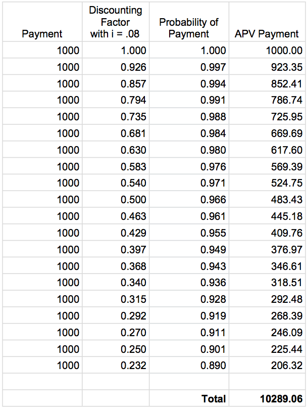

```{r, echo=FALSE, messages = FALSE, warning=FALSE, results='hide'}
library(lifecontingencies)
```

#Outstanding Material 
- Add continuous example to Section 3.2
- Add continuous problem in problems section
- More discussion of problems / solutions ?

#Introduction

In the previous module, we looked at life insurance and introduced the concept of actuarial present value. Life insurance payments were often contingent upon death, and now we turn to a form of payments that are often contingent upon survival: **life annuities**. Recall that an annuity is a series of payments that occur at equal intervals over time. Life annuities play a major role in life insurance operations, as well as pension systems. A life annuity of premiums is usually used to purchase life insurance rather than a lump sum, and a retirement plan can be thought of as a system for purchasing deferred life annuities.

All of the previous annuity concepts from finance hold true, but now we have the added condition of survival. Payments may occur continuously or at equal intervals, and payments can occur at the beginning or end of periods. In our introduction of the topic here, we will focus primarily on discrete life annuities with payments made at the beginning of the year (annuities-due), because they have a more prominent role in actuarial applications.

##3.1 Concepts

We’ll begin with a simple example where a person pays for life insurance with a life annuity of premiums. The person pays 1 at the beginning of each year for the next 5 years. If this was an annuity from BUS 342, we would write the sum and discount each payment to time zero. However, with a life annuity the person can only make these payments as long as they are living, so each payment is contingent upon their probability of survival. 

Suppose for the next 5 years the probability of payment has been determined from a life table to be .95 for each year. With an interest rate of .08, the actuarial present value is written
\[ \text{APV} = (1)(.95) + (1)(.95)v^1 + (1)(.95)v^2 + (1)(.95)v^3 + (1)(.95)v^4 = 4.02615 \]

The above method for calculating APV is known as the **current-payment technique**. This intuitive method is simply discounting the payment being made, and multiplying by the probability that the payment is made in the first place. We write this generally as
\[ \ddot{a}_{x} = \sum_{k=0}^{\infty} \ v^{k} \ _{k}p_{x} . \]

\vspace{.25cm}

With a complete life table, we can do a more extended example. Suppose a person that is 40 wants to purchase life insurance with level payments of $1,000 at the beginning of each year for the next 20 years. An actuary with a life table corresponding to (40) wants to calculate the APV of this annuity. Using the current-payment technique, we can write this out by hand as

\[ \text{APV} = (1000) + (1000)(_{1}p_{40})v^1 + (1000)(_{2}p_{40})v^2 + (1000)(_{3}p_{40})v^3 + \textellipsis +(1000)(_{19}p_{40})v^{19}  \]

We leave the actual computation to the *presentValue* function from the *lifecontingencies* package.

```{r}
data("soa08")
prob <- rep(NA, 20)
prob[1] = 1                                       # probability of first payment is 1
for(i in 1:19){				           # get the probabilities from the lifetable object
  prob[i+1] <- pxt(soa08, x = 40, t = i)            # [i+1] for indexing
}
payments <- rep(1000, 20)
interest <- .08
years <- 0:19				 	# first payment is at year “0” because it's an annuity-due
presentValue(cashFlows = payments, timeIds = years, interestRates = interest, 
                      probabilities = prob)
```
\vspace{.5cm}

\newpage

More often than not, actuaries are utilizing tables in spreadsheet tools like Excel. Here is what a table may look like for computing the APV in the example above.

\

\newpage

##3.2 Mathematics

The current-payment technique is convenient, but how do we know it’s legitimate? For the derivation, we’ll consider a **whole life annuity-due**, which is an annuity that pays at the beginning of each year for every year that (*x*) survives. The present-value random variable, *Y*, is given by $Y = a_{K+1}$, where K is the curtate-future-lifetime of (*x*). The probability associated with the value $a_{K+1}$ is Pr($K=k$) = $_{k}p_{x}\ q_{x+k}$. We use the definition of expected value to write
\[
\text{APV} = \text{E}[Y] = \text{E}[a_{K+1}] = \sum_{k=0}^{\infty} \ \ddot{a}_{\angl{k+1}} \ _{k}p_{x} \ q_{x+k}.
\]

Using summation by parts and by taking advantage of some relations, it can be shown that the above converts to
\[ \ddot{a}_{x} = \sum_{k=0}^{\infty} \ v^{k} \ _{k}p_{x} \]
which is the convenient current payment form.

Let's return to the example of the 40 year old from earlier in the module, but now, they are interested in purchasing life insurance using a whole life annuity with $1000 payments. The summation would be
\[
APV = 1000[1 + (p_{40})v^{1} + (_{2}p_{40}) v^{2} + \textellipsis]
\]


In reality, we do not have probability estimates out to infinity, so we use what the life table can provide. In this case, the life table goes out to 141 years, at which point the probability of survival rapidly approaches 0. The *lifecontingencies* package computes the APV as follows


```{r}
data("soa08")
prob_whole_life <- rep(NA, 101)                    # 101 because lifetable ends at 141
prob_whole_life[1] = 1                              # probability of first payment is 1
for(i in 1:100){				  # get the probabilities from the rest of the lifetable
  prob_whole_life[i+1] <- pxt(soa08, x = 40, t = i)            # [i+1] for indexing
}
payments <- rep(1000, 101)
interest <- .08
years <- 0:100				# first payment is at year “0” because it's an annuity-due
presentValue(cashFlows = payments, timeIds = years, interestRates = interest, 
                      probabilities = prob_whole_life)
```

\vspace{.25cm}

Annuities can also occur with continuous payments. Analogous to the discrete example above, is the **whole life annuity**  which provides for payments until death, so that the present value is $Y = \bar{a}_\angl{t}$ for all $T \ge 0$. To find the actuarial present value we assume a constant payment of 1, and a constant force of interest to set up the integral
\[ \bar{a}_x = \text{E}[Y] =  \int_{0}^{\infty} \bar{a}_\angl{t}  \ _{t}p_{x} \ \mu (x+t) \ dt\]

and use integration by parts to yield
\[ \bar{a}_x = \int_{0}^{\infty} v^t \ _{t}p_{x} \ dt = \int_{0}^{\infty}\ _{t}\text{E}_{x} \ dt . \]

In general, the current payment technique for continuous annuities can be thought of as
\[ APV = \int_{0}^{\infty} v^{t}\ \text{Pr[payment made at time}\ t\text{]} \times [\text{Payment rate at time}\ t] \ dt \]

Similar to what we saw in the life insurance module, there are many different types of annuities that we can create by changing when the payments occur, and their amounts. They can all be written in the intuitive current payment form following derivations very similar to the one above.

\newpage

##Problems

1. A 65 year old man decides to use a 20 year life annuity to purchase his life insurance. The payments occur at the beginning of the year, and an actuary has prepared a life table which corresponds to the man. Using the life_table_65 text file, calculate the APV of this annuity in Excel. 
How does this APV compare to the 20 year life annuity computed for the 40 year old person in the earlier example? Why?

2. Use the *presentValue* function to compute the APV of a whole life annuity for (30) with payments of $10,000 at the beginning of every year and an interest rate of .06. Use the soa08 data table from the *lifecontingencies* package.

\newpage

##Solutions

1.
```{r, echo=FALSE, messages = FALSE, warning=FALSE, results='hide'}
library(lifecontingencies)
```

\

The actuarial present value is $8,432.90.

This is significantly less than the $10,209.06 APV that we computed for the 40 year old. Although both annuities were computed at the same interest rate over the same amount of years, we see a large difference due to the differing probabilities in the life tables.

The probability of survival in each respective time step was lower for the 65 year old, relative to the 40 year old. It makes sense that this would lead to a lower actuarial present value. We would expect the value of the life annuity, which depends on mortality, to be lower if there's less chance of making the payments.

2.
```{r}
data("soa08")
prob_2 <- rep(NA, 111)                    # 111 because lifetable ends at 141
prob_2[1] = 1                              # probability of first payment is 1
for(i in 1:110){				  # get the probabilities from the rest of the lifetable
  prob_2[i+1] <- pxt(soa08, x = 30, t = i)            # [i+1] for indexing
}
payments_2 <- rep(10000, 111)
interest_2 <- .06
years_2 <- 0:110			# first payment is at year “0” because it's an annuity-due
presentValue(cashFlows = payments_2, timeIds = years_2, interestRates = interest_2, 
                      probabilities = prob_2)
```

\newpage

## References

The following resources are available for reference and were involved in the making of this module.

Bowers Jr., Newton, et. al. *Actuarial Mathematics*. The Society of Actuaries. 1997.

http://mort.soa.org/ - SOA life tables

https://cran.r-project.org/web/packages/lifecontingencies/lifecontingencies.pdf - lifecontingencies package