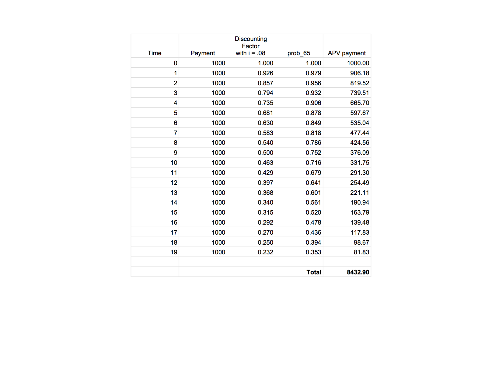

```{r, echo=FALSE, messages = FALSE, warning=FALSE, results='hide'}
library(lifecontingencies)
```

\

The actuarial present value is $8,432.90.

This is significantly less than the $10,209.06 APV that we computed for the 40 year old. Although both annuities were computed at the same interest rate over the same amount of years, we see a large difference due to the differing probabilities in the life tables.

The probability of survival in each respective time step was lower for the 65 year old, relative to the 40 year old. It makes sense that this would lead to a lower actuarial present value. We would expect the value of the life annuity, which depends on mortality, to be lower if there's less chance of making the payments.