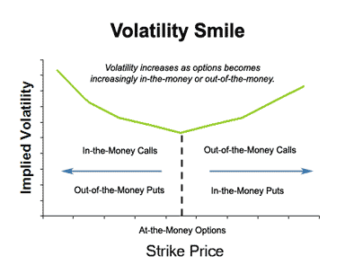

\qquad Option traders use various option pricing models to calculate theoretical option values. The two models for pricing options discussed in this section are the **Binomial option pricing model** and the **Black Scholes option pricing model**.  

## 1 Binomial Option Pricing Model 

\qquad The **Binomial option pricing model** is a simple way to price options by assuming no arbitrage. Meaning no investment opportunities exist that require zero dollars of investment and provide positive yield.   

\qquad The main idea of the **Binomial option pricing model** is that a share of stock can either go up (with probability **p**) or down (with probability **1-p**) over a period of time and we want to price a call option on the stock in a way that allows no arbitrage. 

\qquad In the binomial pricing model we create a binomial tree of prices of the asset across discrete time periods. We look at the price of the asset to calculate the payoff of an option at the discrete time period when the option is callable or putable. We break the time to expiry of the option into periods. In each period, given the price of the underlying asset at the beginning of the period, we assume it can only move to one of two prices at the end of the period. We can then determine the value of the option recursively by starting at the final expiry date, evaluating the value of the uption under each possibility for final price of the underlying asset, and then move backwards through the tree pricing options at each point.    

### 1.1 Risk-neutral One Period Pricing

\qquad The binomial pricing model assumes a risk-neutral world. Meaning that an investor is not recieving a premium for the added risk of the investment and is indifferent to recieving the risk free rate on an asset. We can then use this to calculate the probability (**p**) the the asset will increase in price by discounting the expected value of the binomial tree by the continuous risk free rate. We find this expected value by multiplying the increased price by **p** and adding this to the decreased price by **(1-p)**.

Consider a non-dividend paying stock currently priced at 50 and the price will either be 60 or 40 at the end of the year with a risk-free rate of 5%:

To calculate **p**, assuming a risk-neutral world, we can discount the expected value of the future price at the risk-free rate of $e^{-0.05}$:  
$$
\begin{aligned}
50 &= e^{-0.05}\left(60(p) + 40(1-p)\right)\\
&= e^{-0.05}\left(20p + 40\right)\\
50e^{0.05} &= 20p + 40\\
p &= \frac{50e^{0.05} - 40}{20}\\
&= \frac{50\left(1.051271\right) - 40}{20}\\
&= \frac{12.56355}{20}\\
p &= 0.62818
\end{aligned}
$$
We now have the risk-neutral probability that the stock will go up **p = 0.62818**. Now consider that the strike price of a 1-year call option is 55. The main goal of the binomial model is to be able to fairly price this option. To do this let's think about the possible payoffs of the call option. If the underlying stock price reaches the 60, and the strike price is 55, then the call option will be exercised for a payoff of 5. If the underlying stock price decreases to 40, and the strike price is 55, the option will not be exercised and will have a payoff of 0. Given that we now have calculated the risk-neutral probability of the underlying asset increasing or decreasing, we can discount the expected value of the option (the probability of exercising the option times the payoff of the option) at the risk-free rate to find the fair price of the option. A call option premium at a strike price of 55 for a 1 year option is denoted C(55,1). Note that this expected value is discounted at $e^{-hr}$, where here $h=1$.

$$
\begin{aligned}
C(55,1) &= e^{-0.05}\left((p(5) + (1-p)(0)\right)\\
&= e^{-0.05}\left((0.62818(5) + (1-0.62818)(0)\right)\\
C(55,1) &= 2.9877
\end{aligned}
$$

So the fair price of a 1-year call option at the strike price of 55 will be \$2.99.

### 1.2 Volatility

\qquad The example above is the binomial pricing option for a 1-year non-dividend paying stock. As mentioned before, the time to expiry of the option is broken into periods.  The price of the stock is assumed to go up or down by the same factor in each time period. These factors are commonly denoted as *u*(up) and *d*(down). Here *u* is defined to be greater than or equal to 1, and *d* is defined to be $0 < d \leq 1$. In this case our initial branch went from 50 to either 40 or 60.

$$
\begin{aligned}
50u &= 60\\
u &= 1.2
\end{aligned}
$$
$$
\begin{aligned}
50d &= 40\\
d &= 0.8
\end{aligned}
$$


\qquad The choice of *u* and *d* is not arbitrary. This is where the idea of no arbitrage is important. The upper node must be higher than the result of a  risk-free inverstment, and the lower node must be lower, or else arbitrage would be possible. Either the stock would always be better than the risk-free investment or it would always be worse. This would lead to arbitrage in that you would short as much stock as possible and lend the money from the short possition at the risk-free rate, or you would borrow as much as you could at the risk-free rate to buy stock. A risk-free investment of $S$ produces $Se^{rh}$, while stock produces $Se^{\delta h}$

$$
\begin{aligned}
d < e^{\left(r-\delta\right)h} < u
\end{aligned}
$$
$Se^{\left(r-\delta\right)h}$ is the forward price of the stock, so in order for arbitrage to not be possible the forward price of the stock must be between the upper and lower nodes. If the forward price of the stock can vary over a large range of values it is important for the binomial pricing model to account for this.

\qquad A larger spread between $u$ and $d$ would indicate a larger variance in the stocks price. In the binomial option pricing model we are concerned with the variance of a random variable that takes the values of the continuously compounded rate of return, calculated by ln($u$) and ln($d$). This is treated as a random variable that is assumed to be either ln($u$) or ln($d$) with equal probability, similar to a Bernoulli random variable. So the variance is calculated similarly with $v^2 = 0.25(\text{ln}(u) - \text{ln}(d))^2$. Solving for $u$ we have  

$$
\begin{aligned}
v^2 &= 0.25\text{ln}^2(u/d)\\
4v^2 &= \text{ln}^2(u/d)\\
2v &= \text{ln}(u/d)\\
e^{2v} &= \frac{u}{d}\\
u &= d\,e^{2v}
\end{aligned}
$$

where $v$ is the square root of the variance, defined to be the **volatility**, for one period. It is annualized by dividing it by $\sqrt{h}$, where $h$ is the size of the period. Then we have the annual volatility of the asset which is defined to be $\sigma$.  

\qquad To make sure that the forward price of the stock is captured between the two end points, we use the volatility and its inverse to solve for $u$ and $d$.

$$
\begin{aligned}
u &= e^{\left(r-\delta\right)h + \sigma\sqrt{h}}\\
d &= e^{\left(r-\delta\right)h - \sigma\sqrt{h}}
\end{aligned}
$$

\qquad Volatility is defined as the underlying standard deviation of the logarithm of the proportionate change in price. To estimate it we use the standard deviation of the logarithm of consecutive stock prices, $\text{ln}\left(S_t/S_{t-1}\right)$. This can be calculated daily, weekly, or monthly and converted into the annual volatility, $\sigma$.

$$
\begin{aligned}
\hat{\sigma} &= \sqrt{p}\sqrt{\frac{n}{n-1}\left(\frac{\sum_{i=1}^{n}x_i^2}{n} - \bar{x}^2\right)}
\end{aligned}
$$

Where $n$ is the number of ratios, $x_i = \text{ln}\left(S_i/S_{i-1}\right)$, and $p$ is the number of periods per year. This estimate can be used to solve for $u$ and $h$ in the equations above.  

\qquad Using the values of $u$ and $h$, the present value of the stock based on the starting price, $S\,e^{-\delta h}$ is set equal to the expected present value of the stock price at the end points $u$ and $d$. The general formula for **p** is then found by solving for p.

$$
\begin{aligned}
S\,e^{-\delta h} &= e^{-rh}\left(p\,u\,S + (1-p)d\,S\right)\\
e^{-\delta h} &= e^{-rh}\left(p\,u + (1-p)d\right)\\
&= e^{-rh}\left(p(u-d)+d\right)\\
e^{rh-\delta h} &= p(u-d) + d\\
p &= \frac{e^{rh-\delta h} - d}{u-d}
\end{aligned}
$$

### 1.3 Risk-neutral Multi-period Pricing 

\qquad The previous example above (section 1.1) is a one period tree. Consider a put option on the same stock with u = 1.2 and d = 0.8 with a time to expiry of two years. We now have a two period tree. Now for the second period the prices are defined to change by the same factor. From 60, the stock price can go up by a factor of 1.2 (72), or it can go down by a factor of 0.8 (48). 
Similarly for 40, the stock price can either be 48 or 32. In this case, we price from the final expiry date and work backwards to find the initial price of the call option at each period until we get to the current time period. We will continue to use a risk-free rate of 0.05, a strike price of 60, and a stock that pays no dividends.   

First we want the risk neutral probability **p** that the value of the stock will increase. Using the equation described above we can solve for **p** quickly.

$$
\begin{aligned}
p &= \frac{e^{rh-\delta h} - d}{u-d}\\
&= \frac{e^{0.05(2)}-0.8}{1.2-0.8}\\
&=0.7629
\end{aligned}
$$
Now that we have **p** we want the payoff of the option if exercised at each possibility in two years. Consider the possibilities of final stock prices that we established above of either 72, 48, 48, or 32. The payoffs of exercising the put option at the strike price of 60 would be 0, 12, 12, and 18 respectively.  

We can think of this path that the stock price takes as a random variable X, that has a Binomial(p = 0.7629, n = 2) distribution and calculate the probability of each outcome.   

For example Pr(X = 2) represents the probability that the stock increased in value at both nodes.   
$$\text{Pr}(X=2) = {2 \choose{2}} (0.7629)^2 = 0.582$$
Similarly for Pr(X = 1) and Pr(X = 0)  
$$
\begin{aligned}
\text{Pr}(X = 1) &= {2\choose1} (0.7629)(1-0.7629) = 0.3618\\
\text{Pr}(X = 0) &= {2\choose0}(1-0.7629)^2 = 0.0562
\end{aligned}
$$
We then use these probabilities to calculate the expected value of the payoff. At $(X = 2)$ the payoff on the put option would be zero, $(X = 1)$ would pay 12, and $(X = 0)$ would pay 18. So the expected value of the put option would be

$$ (0.582)(0) + (0.3618)(12) + (0.0562)(18) = 5.3532 $$
Discounting this expected payoff at the risk-free rate of 0.05 over two years we have a put premium of $e^{-0.05}(5.3532) = 5.0921$.

### 1.4 Limitations to the Binomial pricing model

\qquad There are clear limitiations to this model. We know that at each point in time that the value of a stock does not have two possible values. There is a continuous distribution of values that this stock price can take and in our current model the only way to account for that is to reduce the time between valuations to smaller and smaller intervals of time. For example, instead of checking the price of the stock at 6 months to instead check the price at each month, day, hour etc. This will change the values of u and d in our equations. In reality the stock price changes continuously and as we adjust these values of u, p, h etc. we essentially are taking the limit as h becomes very close to 0.  

\qquad This limiting process of the binomial formula converges to the Black-Scholes model discussed in section 2 below. This assumes a lognormal distribution of prices and relies on the central limit theorem to show that "as the number of periods into which the fixed length of time to expiration is divided approaches infinity, the probability that the standardized continuously compounded rate of return of the stock through the expiration date is not greater than the number z approaches the probability under a standard normal distribution"(Journal of Financial Econmics 7(1979)).  


\newpage


## 2 Black-Scholes Pricing Model

\qquad The **Black-Scholes pricing model** is used to calculate the theoretical value of European-style options using current stock prices, expected dividends, the option's strike price, risk-free interest rate, time to expiration and expected volatility.

The general form of the formula, the price at time 0 of a European call option expiring at time $T$ on an asset $S$, where $N(x)$ is the normal cdf at $x$, is

$$
C(S, K, \sigma, r, T,\delta) = F^P(S)N(d_1)-F^P(K)N(d_2)
$$
where

$$
\begin{aligned}
d_1 &= \frac{\text{ln}\left(F^P(S)/F^P(K)\right) + \frac{1}{2}\sigma ^2 T}{\sigma\sqrt{T}}\\
d_2 &= d_1 -\sigma \sqrt{T}
\end{aligned}
$$
$F^P$ indicates a prepaid forward price. $S$ is the underling asset and $K$ is the strike asset.

The assumptions of the Black-Scholes formula are as follows:  
- Continuously compounded retuns on the stock are normally distributed and independent over time.  
- Continuously compounded returns on the strike asset are known and constant.  
- Volatility is known and constant.  
- Dividends are known and constant.  
- There are no transaction costs or taxes.  
- It is possible to short-sell any amount of stock and to borrow any amount of money at the risk-free rate.  

### 2.1 Black-Scholes Formula for options

\qquad For call options on common stock with continuous dividends, $S$ is the common stock and $F^P(S) = Se^{-\delta t}$, where $\delta$ is the continuous dividend rate. The strike asset is cash, whose prepaid forward price is $F^P(K) = Ke^{-r t}$, where $r$ is the continuously compounded risk free rate. Therefore

$$
\begin{aligned}
\text{ln}F^P(S) &= \text{ln}S-\delta T\\
\text{ln}F^P(K) &= \text{ln}K-rT
\end{aligned}
$$
and the Black-Scholes formula can be written as

$$
C(S,K,\sigma,r,T,\delta ) = Se^{-\delta T}N(d_1) - Ke^{-rT}N(d_2)
$$
where
$$
\begin{aligned}
d_1 &= \frac{\text{ln}\left(S/K\right) + \left(r - \delta + \frac{1}{2}\sigma ^2\right) T}{\sigma\sqrt{T}}\\
d_2 &= d_1 -\sigma \sqrt{T}
\end{aligned}
$$

For put options, the roles of $S$ and $K$ are reversed

$$
P(S,K,\sigma, r,T,\delta) = Ke^{-rT}N(-d_2) - Se^{-\delta T}N(-d_1)
$$

while $d_1$ and $d_2$ are defined the same way as the call option.

For example, let's consider a 6-month European option with a strike price of 35 on a stock currently valued at 30. Assuming that the stock meets the conditions of the Black-Scholes model, with a volatily of 0.5, continuous divendend rate of 4%, and continuously compounded risk-free interest rate of 8% we can calculate the premiums for call and put options on this stock.

From this information given we have $S=30, K=35, r=0.08, \sigma=0.3,t = 0.5,\delta = 0.04$. Using the Black-Scholes formula for the call option

$$
\begin{aligned}
d_1 &= \frac{\text{ln}(30/35) + \left(0.08-0.04+\frac{1}{2}(0.3^2)\right)(0.5)}{0.3\sqrt{0.5}}\\
&= -0.52633\\
N(d_1) &= N(-0.52633) = 0.29933\\
d_2 &= -0.52633 - 0.3\sqrt{0.5} = -0.67633\\
N(d_2) &= N(-0.67633) = 0.24942\\
C(30,35,0.3,0.08,0.5,0.04) &= 30e^{-0.5(0.04)}(0.29933) - 35e^{-0.5(.08)}(0.2492)\\
&= 0.422
\end{aligned}
$$
Similarly for the premium of the put is
$$
\begin{aligned}
N(-d_2) &= 1 - N(d_2) = 0.75058\\
N(-d_1) &= 1 - N(d_1) = 0.70067\\
P(30,35,0.3,0.08,0.5,0.04) &= 35e^{-0.5(.08)}(0.75058) - 30e^{-0.5(0.04)}(0.70067)\\
&= 4.636
\end{aligned}
$$

\newpage

### 2.2 Limitations of the Black-Scholes formula

\qquad The list of assumptions needed for the Black-Scholes pricing formula to be valid are a major limitation to the model. One key assumption that is typically violated is the assumption that the volatility of the stock price is constant. The Black-Scholes model assumption would say that at a given maturity and all other factors held constant that a change in the strike price would not affect the volatility and that the volatility would remain constant. It is expected that the implied volatility would hold constant across the varying values of strike price.  

\qquad This is can be shown to be violated when we look at changes in the option's strike price affecting whether the option is in or out of the money. In general, the more an option is in or out of the money the greater the implied volatility becomes. When plotting this relationship of strike price to implied volatility there is a phenomena known as the Volatility smile that we see occurring.

```{r, out.width = "250px", echo=FALSE,fig.align='center'}

```

This goes against what we would expect in the assumptions of the Black-Scholes pricing model and can become increasingly a problem in fair pricing as the spot price is farther in or out the money.

\newpage  

# Problems

## 1.
A put option is priced using a one-period binomial tree based on forward prices for the underlying stock. Determine the volatility of the stock price given:  
- The period of the tree is four months.  
- The option expires in four months.  
- The current stock price is 25.  
- The stock pays no dividends.  
- The continuously compounded risk-free rate is 0.1.  
- The strike price of the option is 30.  
- The resulting price of the option is 3.00.  

## 2.
For a 1 year European call option on a stock calculate the option premium using a 3 period binomial tree given:  
- The stock price is 200.  
- The strike price is 250.  
- u = 1.4 and d = 0.6.  
- The risk-free continuously compounded interest rate is 0.05.  
- There are no dividends.  


## 3.
For a European call option on a stock that meets the Black-Scholes conditions calculate the premium for the stock option given:  
- The stock's price is 40.
- The stock's volatility is 0.2.  
- The stock pays no dividends.   
- The risk-free continuously compounded interest rate is 0.07.  
- The option expires in 6 months.  
- The strike price is 30.  


\newpage

# Solutions

## 1.

## 2.
